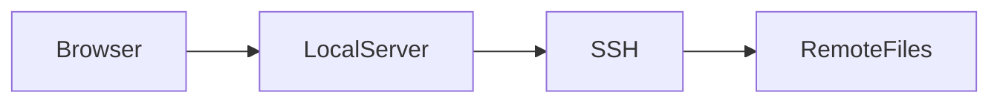

# remote-preview MVP

SSH先のディレクトリを、ローカルブラウザから **read-only Webファイラー** として閲覧する小さなCLIです。

リモート側にHTTPサーバや専用agentを入れず、system `ssh` だけを使います。

## Features

- `host:/absolute/path` を指定してWebファイラーとして閲覧
- `host` だけを指定すると、リモートのhome directoryを閲覧
- system `ssh` を利用
  - `~/.ssh/config`
  - Host alias
  - IdentityFile
  - ProxyJump
  - ssh-agent
  - ControlMaster
  などをそのまま利用
- リモートのPOSIX `sh`（macOS / BusyBoxを含む）でcurrentと直下directoryをbatch listing
- ディレクトリ一覧とbreadcrumb navigation
- HTML: そのままブラウザでpreview
- Markdown: GitHub Flavored Markdown (GFM) preview
  - tables
  - strikethrough
  - task lists
  - autolinks
- ` ```mermaid ` fenced code blockをMermaidとして描画
- PNG/JPEG/WebP/SVGなど: そのまま表示
- source code / JSON / YAML / textなど: text viewer
- `Raw` 表示
- directory listingのTTL cacheと同時アクセスの重複抑制
- macOS / BusyBox互換のforeground batch listing
- SSH command/connect timeoutとrequest context cancellation
- read-only

## Quick start (macOS Apple Silicon)

```bash
chmod +x remote-preview-darwin-arm64
./remote-preview-darwin-arm64 -open remote-host:/remote/path/project
```

ブラウザで:

```text
http://127.0.0.1:8080/
```

## Example

```bash
./remote-preview-darwin-arm64 -open remote-user@remote.example.com:/remote/path/docs
```

普段 `~/.ssh/config` にaliasを書いているなら、そのaliasをそのまま使えます。

```sshconfig
Host remote-host
    HostName remote.example.com
    User wiki
    ProxyJump bastion

Host bastion
    HostName example.com
    User remote-user
```

```bash
./remote-preview-darwin-arm64 -open remote-host:/remote/path/project
```

## Markdown / Mermaid

Markdown viewerはブラウザ側で `marked` のGFM modeを使います。Mermaid blockはMermaidで描画します。

````markdown
# Architecture

| component | role |
| --- | --- |
| browser | viewer |
| SSH | transport |


````

Markdown renderer / Mermaidは現在jsDelivrからbrowser側で読み込むため、Markdownのrich previewにはインターネット接続が必要です。CDNを読めない場合でもMarkdown sourceは表示されます。

## Build

Go 1.23+のみ必要です。Go module dependencyはありません。

```bash
go build -o remote-preview ./cmd/remote-preview
```

## Project layout

- `cmd/remote-preview`: CLI entrypoint only
- `internal/preview`: target parsing、SSH transport、directory cache、HTTP handler、templateとそのtests
- `issues/`: 実装scopeと検証結果

## Usage

```bash
./remote-preview [options] host:/absolute/path
```

リモートhomeを開く場合はhostだけを指定できます。

```bash
./remote-preview -open remote-host
```

ブラウザを自動で開く:

```bash
./remote-preview -open remote-host:/remote/path/project
```

listen address変更:

```bash
./remote-preview -addr 127.0.0.1:7391 remote-host:/remote/path/project
```

空いているportを使う場合は`-addr :0`を指定できます。実際にlistenしたURLがログに表示されます。

request log:

```bash
./remote-preview -v remote-host:/remote/path/project
```

debug log:

```bash
DEBUG=1 ./remote-preview -addr 127.0.0.1:7391 remote-host:/remote/path/project
```

debug logは標準ライブラリの`log/slog`によるkey-value形式で、HTTP request、cache hit/miss、batch listingのfallback、SSH commandの`operation`・`remote_path`・`duration`・`bytes`を出力します。`DEBUG`未設定時はdebug levelのログを出力しません。`-v`は通常のrequest logを有効にします。

## How it works

ブラウザから要求が来ると、ローカル側の `remote-preview` がsystem `ssh` を呼びます。directory listingはcache miss時にforegroundで取得し、対応backendではcurrentと最大16個の直下directoryのlistingを1回のportable shell commandにまとめます。同じdirectoryへの同時アクセスは1回のSSH listingにまとめます。batch commandが使えない場合はsingle-directory listingへfallbackします。background prefetchは行いません。ファイル内容はcacheしません。

```text
Browser
   |
   | HTTP localhost
   v
remote-preview
   |
   | system ssh
   | (~/.ssh/config / ProxyJump / agent ...)
   v
Remote filesystem
```

リモートにはサーバプロセスを起動しません。

## MVP limitations

- cacheされていないremote accessではSSH processを起動する
- directory listingはremote shellを使う
- directory listing cacheの既定TTLは10秒、最大256エントリ
- ファイル名にtab/newlineが含まれる場合はdirectory listing非対応
- Range request未対応
- live reload未対応
- file edit / upload / rename / deleteは未対応
- Markdown / Mermaidのrich renderingはCDN依存
- SSH URI形式やIPv6 literalのtarget parserは未対応

SSH ControlMasterを有効にすると、requestごとのconnection overheadをかなり減らせます。

```sshconfig
Host *
    ControlMaster auto
    ControlPersist 5m
    ControlPath ~/.ssh/cm-%C
```
