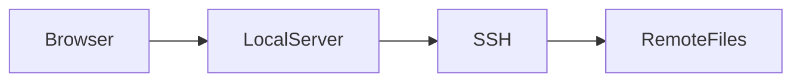

# remote-preview

SSH先のディレクトリを、ローカルブラウザから **read-only Webファイラー** として閲覧する小さなCLIです。

リモート側にHTTPサーバや恒久的なagentを入れず、system `ssh` で必要な処理だけを実行します。directory batch listingでは、対応platform向けのGo helperをremote `TMPDIR`配下へversion/hash付きで配置し、次回以降も再利用します。

## Features

- `host:/absolute/path` を指定してWebファイラーとして閲覧
- `host` だけを指定すると、リモートのhome directoryを閲覧
- `.`, `./relative/path`, `../relative/path`, `/absolute/path`を指定するとlocal filesystemを閲覧
- system `ssh` を利用
  - `~/.ssh/config`
  - Host alias
  - IdentityFile
  - ProxyJump
  - ssh-agent
  - ControlMaster
  などをそのまま利用
- remote-side Go helper（Linux/darwinのamd64/arm64）でcurrentと直下directoryをbatch listing
- helperが使えない場合はPOSIX `sh`（macOS / BusyBoxを含む）のbatch listingへfallback
- ディレクトリ一覧とbreadcrumb navigation
- HTML: そのままブラウザでpreview（通常のファイルリンクから直接表示）
- Markdown: GitHub Flavored Markdown (GFM) preview
  - tables
  - strikethrough
  - task lists
  - autolinks
- ` ```mermaid ` fenced code blockをMermaidとして描画
- PNG/JPEG/WebP/SVGなど: そのまま表示
- source code / JSON / YAML / textなど: browser内text viewer
- 対応するsource codeは同梱のhighlight.jsでsyntax highlight
- `Raw` 表示
- directory listingのTTL cacheと同時アクセスの重複抑制
- macOS / BusyBox互換のforeground batch listing
- SSH command/connect timeoutとrequest context cancellation
- read-only

## Quick start (macOS Apple Silicon)

```bash
make build
./bin/remote-preview remote-host:/remote/path
```

ユーザーのGo install先（通常は`~/go/bin`）へinstallする場合:

```bash
make install
"$(go env GOPATH)/bin/remote-preview" remote-host:/remote/path
```

`GOBIN`を設定している場合は、Go toolchainの設定に従ってそのdirectoryへinstallされます。実際の配置先は`go env GOBIN`または`go env GOPATH`で確認できます。

ブラウザで:

```text
http://127.0.0.1:8080/
```

## Example

```bash
./remote-preview-darwin-arm64 remote-user@remote.example.com:/remote/path
```

普段 `~/.ssh/config` にaliasを書いているなら、そのaliasをそのまま使えます。

```sshconfig
Host remote-host
    HostName remote.example.com
    User remote-user
    ProxyJump bastion

Host bastion
    HostName bastion.example.com
    User jump-user
```

```bash
./remote-preview-darwin-arm64 remote-host:/remote/path
```

## Markdown / Mermaid

Markdown viewerはブラウザ側で `marked` のGFM modeを使います。Mermaid blockはMermaidで描画します。

````markdown
# Architecture

| component | role |
| --- | --- |
| browser | viewer |
| SSH | transport |


````

Markdown renderer / Mermaid / syntax highlightのbrowser assetはremote-preview binaryへ同梱し、localhostから配信します。そのため、通常のpreview表示に外部インターネット接続は必要ありません。assetの読み込みやrich renderingに失敗した場合でもMarkdown sourceとtext sourceへfallbackします。assetのversionとlicenseは`THIRD_PARTY_NOTICES.md`に記録しています。

## Build

Go 1.23+のみ必要です。Go module dependencyはありません。通常のbuildと検証はMakefileから実行できます。

```bash
make build
./bin/remote-preview remote-host:/remote/path
```

remote-side helperの埋め込みartifactはLinux/darwinのamd64/arm64向けに同梱しています。artifactを再生成する場合は次を実行します。

```bash
make generate
```

主なdevelopment command:

```bash
make test       # go test ./...
make test-race  # go test -race ./...
make vet        # go vet ./...
make build-helper # standalone remote-preview-helperをbin/へbuild
make install    # go install ./cmd/remote-preview（通常は~/go/bin）
make check      # generate + test + race + vet + build
make clean      # bin/のMakefile生成物を削除
```

## Project layout

- `cmd/remote-preview`: CLI entrypoint only
- `cmd/remote-preview-helper`: remote-side filesystem helper entrypoint
- `internal/preview`: target parsing、SSH transport、directory cache、HTTP handler、templateとそのtests
- `internal/preview/assets.go`: 同梱browser assetのembedとlocalhost配信
- `internal/preview/assets`: marked、Mermaid、highlight.js/CSSのversion固定asset
- `internal/remotehelper`: helperのfilesystem traversalとbatch protocol writer
- `scripts/generate-remote-helpers.sh`: helper artifactのcross buildと圧縮
- `Makefile`: build、test、verification command
- `THIRD_PARTY_NOTICES.md`: 同梱browser assetのversionとlicense
- `issues/`: 実装scopeと検証結果

## Usage

```bash
./bin/remote-preview [options] target
```

local filesystemを表示する場合:

```bash
./bin/remote-preview .
./bin/remote-preview ./subdir
./bin/remote-preview /absolute/path
```

リモートhomeを開く場合はhostだけを指定できます。

```bash
./bin/remote-preview remote-host
```

リモートのhome基準のpathも指定できます。

```bash
./bin/remote-preview remote-host:~/projects
./bin/remote-preview remote-host:projects
```

ブラウザはデフォルトで自動的に開きます。自動起動を無効にする場合:

```bash
./bin/remote-preview -open=false remote-host:/remote/path
```

listen address変更:

```bash
./bin/remote-preview -addr 127.0.0.1:7391 remote-host:/remote/path
```

指定portが使用中の場合は、同じhostの後続portへ自動的にずらしてlistenします。空いているportを使う場合は`-addr :0`を指定できます。実際にlistenしたURLが`open: http://.../`形式の通常出力として表示されます。diagnostic logはstderrへ出力されます。

request log:

```bash
./bin/remote-preview -v remote-host:/remote/path
```

debug log:

```bash
DEBUG=1 ./bin/remote-preview -addr 127.0.0.1:7391 remote-host:/remote/path
```

debug logは標準ライブラリの`log/slog`によるkey-value形式で、HTTP request、cache hit/miss、batch listingのfallback、SSH commandの`operation`・`remote_path`・`duration`・`bytes`を出力します。`DEBUG`未設定時はdebug levelのログを出力しません。`-v`は通常のrequest logを有効にします。

## How it works

ブラウザから要求が来ると、ローカル側の `remote-preview` がsystem `ssh` を呼びます。directory listingはcache miss時にforegroundで取得し、対応platformではremote `TMPDIR`に残したGo helperがcurrentと最大16個の直下directoryのlistingを1回で取得します。helper cacheがなければatomicにuploadし、同じhelper binaryが残っていればbinary転送を省略します。helperを利用できない場合はportable shell batchへ、さらに失敗した場合はsingle-directory listingへfallbackします。同じdirectoryへの同時アクセスは1回のSSH listingにまとめます。background prefetchは行いません。ファイル内容はcacheしません。

helperは最初のbatch listing時にremote platform判定を行います。cache miss時だけbinary uploadが発生するため、ProxyJumpや高RTTの環境でも同じhelper binaryを使う次回起動では転送コストを抑えられます。cache filenameにはcache version、platform、展開後binaryのSHA-256を含めます。cache miss時のuploadはSSH channel compressionを使い、remote側にgzip commandを要求しません。helper実行に失敗した場合は該当cacheを削除してshell batchへfallbackします。

```text
Browser
   |
   | HTTP localhost
   v
remote-preview
   |
   | system ssh
   | (~/.ssh/config / ProxyJump / agent ...)
   v
versioned helper cache or POSIX shell
   |
Remote filesystem
```

リモートにはHTTP serverや恒久的daemonを起動しません。helper自体はSSH commandから起動する短命processですが、helper binaryは次回起動で再利用するためremote `TMPDIR`に残ります。stale cacheの自動GCはまだ行いません。

## Limitations

- cacheされていないremote accessではSSH processを起動する
- directory listingはGo helperまたはportable remote shellを使う
- directory listing cacheの既定TTLは10秒、最大256エントリ
- batch listingのprotocolはtab/newlineを含むfilenameを保持する。single-directory shell fallbackではnewlineを含むfilenameを完全には扱えない
- Range request未対応
- live reload未対応
- file edit / upload / rename / deleteは未対応
- HTML/SVGはread-only用途の同一origin上で直接表示するため、信頼できるremote fileだけを開く
- Markdown / Mermaid / syntax highlightのbrowser assetを同梱するため、binary sizeが増える
- SSH URI形式やIPv6 literalのtarget parserは未対応
- Windows remote helperは未対応で、現状はshell fallbackを試みる
- helper cacheがない場合はplatform判定とbinary uploadが発生するため、高RTTやProxyJump環境では初回表示が遅くなる場合がある。cache hit時はbinary uploadを行わない
- remote helper cacheのstale entryは自動GCしない

SSH ControlMasterを有効にすると、requestごとのconnection overheadをかなり減らせます。

```sshconfig
Host *
    ControlMaster auto
    ControlPersist 5m
    ControlPath ~/.ssh/cm-%C
```
